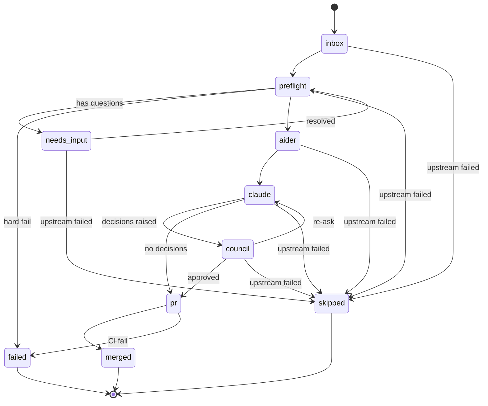

# ADR-0012: Project / Phase Pipeline Data Model

**Repo:** jarvis-standards
**Status:** Proposed
**Date:** 2026-05-13
**Author:** Claude Code (Sandbox)
**Supersedes:** None
**Related:** ADR-0005 (commit conventions), ADR-0011 (spec.md format)

---

## 1. Context

### 1.1 What this ADR is

ADR-0011 standardizes the **single-spec** Forge pipeline: drop one
`spec.md` into `specs/inbox/`, the inbox watcher runs it through preflight
→ Claude → PR. The walk-away loop is operational as of 2026-05-13.

The next step in Forge's evolution is **project-MD-driven phase
pipelines**: a single project document defines a sequence of phases
(epics), each phase decomposes to one or more specs that flow through the
same single-spec pipeline. A project is to a phase what a phase is to a
spec — strict containment, each layer owning its own state.

Without a documented data model, the project layer would re-invent
contracts the spec layer already pinned down (frontmatter shape, state
transitions, identity rules) and would couple operator tooling to
whatever shape happens to land first in `jarvis-forge`. This ADR closes
the loop before that drift starts.

### 1.2 Why now

Three forces are pulling toward this shape simultaneously:

1. **Forge** is ready for the next layer. The walk-away loop's
   single-spec contract is stable (ADR-0011), the runner's commit-first
   discipline is enforced (TD-FORGE-RUNNER-STASH closed), and the agent
   identity contract is locked (TD-FORGE-AGENT-IDENTITY closed). The
   missing piece is a multi-spec orchestration layer.

2. **Council** (separate repo, planned) needs to evaluate work in
   project-sized units, not spec-sized. A 4-lens Council review of one
   spec is overkill; a 4-lens review of a phase that touches 6 specs is
   the right grain.

3. **Aider** is a forward-compatibility concern. The current Forge
   adapter chain is `claude_runner` only; Aider as a draft-layer
   pre-processor is a planned addition. The data model should leave a
   labelled slot for `AiderRun` artifacts without requiring code today.

### 1.3 Scope

In scope:

- Schemas for `Project`, `Phase`, `PreflightResult`, `AiderRun`,
  `ClaudeRun`, `CouncilDecision`, `ActivityEvent`, `RunLog`.
- SQLite index schema (mirror of file state).
- File/folder layout convention.
- GitHub PR + Issue convention.
- State machine of allowed transitions.

Out of scope (deliberately):

- Runtime envelopes between modules (internal to each consumer).
- Council's 4-lens prompt / scoring rubric (separate ADR in
  `jarvis-council`).
- Per-language linting standards (covered by ADR-0009 et al.).
- Auto-merge policy (operator review remains gate; ADR-0005 §10
  governs trailers).

---

## 2. Decision

The data contracts defined in §4 are the canonical project / phase
pipeline schemas. Any module orchestrating multi-spec work (Forge,
Council, future consumers) **MUST** use these schemas as the wire format
between layers.

Three architectural choices, locked after a 4-lens review:

1. **Hybrid storage.** Markdown files are the source of truth for
   project, phase, and run log content; SQLite is an *index* over them
   for fast lookup, never the authority. A repo rebuilt from MDs alone
   is a valid state.

2. **Hybrid state machine.** Each phase carries a `current_stage` field
   (enum, single source of truth for the present) AND emits an append-only
   `activity_events` log (history of every transition). The current_stage
   makes queries cheap; the log makes audits possible.

3. **GitHub PRs + Issues for governance.** A `Phase` opens a GitHub
   Issue (one per phase, lifecycle-bound). Each spec inside a phase opens
   a PR (the existing Forge pattern). Project-level discussions go in the
   project repo's `discussions/` (separate concern).

Every schema in §4 carries a `schema_version: int` field (default `1`)
from day one. Consumers must reject payloads with a version they don't
recognize.

---

## 3. Decision summary

- **Storage:** MDs are truth, SQLite is index.
- **State:** `current_stage` field + `activity_events` log.
- **Governance:** GitHub Issue per phase; GitHub PR per spec.
- **Schemas:** `Project`, `Phase` (extends ADR-0011 `spec.md`),
  `PreflightResult`, `AiderRun` (forward-compat), `ClaudeRun`,
  `CouncilDecision` (strict 4-lens), `ActivityEvent`, `RunLog`.
- **Versioning:** `schema_version: int` on every schema, default `1`.
- **State machine:** linear forward path with two backward edges
  (`needs_input` → `preflight` and `council` → `claude` re-ask); see §8.
- **Identity:** all commits opened by agent layers carry the
  `Claude Code <claude-code@jarvis.local>` identity per
  TD-FORGE-AGENT-IDENTITY (resolution path).

---

## 4. Schemas

### 4.1 Project

A project is the top-level container. One project decomposes into N
phases. Stored as a markdown file with YAML frontmatter at
`projects/<project_id>/project.md`.

| Field | Type | Required | Description |
|---|---|---|---|
| `schema_version` | int | yes | Default `1`. Bumped on breaking changes. |
| `id` | string | yes | Stable identifier, kebab-case (e.g. `forge-multi-spec`). Matches the parent directory name. |
| `title` | string | yes | Human-readable name. |
| `owner` | string | yes | GitHub handle of the human operator. |
| `status` | enum | yes | `planning` / `active` / `paused` / `done` / `abandoned`. |
| `priority` | enum | yes | `P0` / `P1` / `P2` / `P3`. |
| `target_completion` | date | no | ISO-8601 (`YYYY-MM-DD`). Soft; not a gate. |
| `phases` | list[string] | yes | Ordered list of phase IDs. Drives the rendering of the project's phase index. |
| `description` | string | yes | Body text under `# Description` H1. Free-form markdown. |
| `success_criteria` | list[string] | yes | Body bullets under `# Success Criteria` H1. Each entry is a measurable assertion. |
| `out_of_scope` | list[string] | no | Body bullets under `# Out of Scope` H1. Useful for future-self audits. |

#### Example

```yaml
---
schema_version: 1
id: forge-multi-spec
title: Forge multi-spec project pipeline
owner: kphaas
status: active
priority: P1
target_completion: 2026-06-15
phases:
  - p01-data-model
  - p02-project-watcher
  - p03-phase-orchestrator
---

# Description

Extend Forge's single-spec walk-away loop into a multi-spec, multi-phase
orchestrator driven by a project MD. See ADR-0012.

# Success Criteria

- A project.md drop into projects/inbox/ triggers phase processing.
- Each phase opens a GitHub Issue scoped to its specs.
- Phase state transitions are visible in activity_events.log.

# Out of Scope

- Cross-project dependencies (single project, sequential phases only for v1).
- Auto-merge of phase PRs.
```

### 4.2 Phase

A phase is the middle layer. One phase decomposes into N specs (each
spec is exactly the ADR-0011 `spec.md` format). Stored at
`projects/<project_id>/phases/<phase_id>/phase.md`.

A phase **extends** the spec.md shape from ADR-0011 — it shares the
same body sections (`# Description`, `# Acceptance Criteria`) and the
same `target_repo` / `target_branch` semantics. The fields new to
`Phase` are listed below.

| Field | Type | Required | Description |
|---|---|---|---|
| `schema_version` | int | yes | Default `1`. |
| `id` | string | yes | Kebab-case. Matches parent directory. |
| `project_id` | string | yes | The parent project's `id`. Must match the project.md `id` field. |
| `title` | string | yes | Human-readable name. |
| `status` | enum | yes | `proposed` / `active` / `blocked` / `done`. |
| `priority` | enum | yes | `P0`–`P3`. |
| `target_repo` | string | yes | Same semantics as ADR-0011 `spec.md`. |
| `target_branch` | string | yes | Default `main`. Same as ADR-0011. |
| `current_stage` | enum | yes | See §8 state machine. `inbox` on creation. |
| `specs` | list[string] | yes | Ordered list of spec.md filenames under this phase's `specs/` directory. |
| `description` | string | yes | Body under `# Description` H1. |
| `acceptance_criteria` | list[string] | yes | Body checkboxes under `# Acceptance Criteria` H1, per ADR-0011 §3. |
| `github_issue` | int | no | The phase's tracking issue number. Set after the Forge watcher opens it. |
| `aider_run_ref` | string | no | Forward-compat: path to the AiderRun JSON if the Aider draft layer ran on this phase. |
| `claude_run_ref` | string | no | Path to the ClaudeRun JSON. |
| `council_decision_ref` | string | no | Path to the CouncilDecision JSON if Council reviewed this phase. |

#### Example

```yaml
---
schema_version: 1
id: p01-data-model
project_id: forge-multi-spec
title: Define and merge the project/phase data model ADR
status: active
priority: P1
target_repo: jarvis-standards
target_branch: main
current_stage: claude
specs:
  - 01-draft-adr-0012.md
  - 02-update-readme.md
github_issue: 47
claude_run_ref: runs/p01-data-model/claude_2026-05-13T14-00-00Z.json
---

# Description

Land ADR-0012 in jarvis-standards. Update the ADR README index.

# Acceptance Criteria

- [ ] ADR-0012 merged to main.
- [ ] ADR README updated.
- [ ] No CI regressions.
```

### 4.3 PreflightResult

Output of the preflight stage. One per phase per attempt (re-runs append
a new file). Stored at
`projects/<project_id>/phases/<phase_id>/runs/preflight_<iso8601>.json`.

| Field | Type | Required | Description |
|---|---|---|---|
| `schema_version` | int | yes | Default `1`. |
| `phase_id` | string | yes | The parent phase's `id`. |
| `attempt_id` | string | yes | Monotonic counter or ISO timestamp; unique per phase. |
| `started_at` | string | yes | ISO-8601 timestamp. |
| `finished_at` | string | yes | ISO-8601 timestamp. |
| `verdict` | enum | yes | `pass` / `fail` / `needs_input`. |
| `risk_band` | enum | yes | `low` / `medium` / `high`. |
| `risk_score` | float | yes | Numeric, in `[0.0, 1.0]`. |
| `checks` | list[object] | yes | Per-check results. Each object: `{name: str, status: "pass"|"fail"|"warn", note: str}`. |
| `questions` | list[string] | no | Populated only when `verdict == "needs_input"`. Each entry is a question the operator must resolve before re-running preflight. |
| `summary` | string | yes | One-line human summary. |

#### Example

```json
{
  "schema_version": 1,
  "phase_id": "p01-data-model",
  "attempt_id": "2026-05-13T14-00-00Z",
  "started_at": "2026-05-13T14:00:00Z",
  "finished_at": "2026-05-13T14:00:03Z",
  "verdict": "needs_input",
  "risk_band": "low",
  "risk_score": 0.2,
  "checks": [
    {"name": "target_repo_exists", "status": "pass", "note": ""},
    {"name": "branch_namespace_valid", "status": "pass", "note": ""},
    {"name": "acceptance_criteria_resolvable", "status": "warn", "note": "criterion 2 references an external doc"}
  ],
  "questions": [
    "Criterion 2 mentions docs/IMPL.md — does that file exist or should we create it first?"
  ],
  "summary": "Preflight blocked: one criterion references an unresolved external doc"
}
```

### 4.4 AiderRun (forward-compat)

Output of the Aider draft layer. **Not implemented in v1** — included
here so the schema is stable before the first consumer arrives. Forge's
current pipeline skips Aider entirely; the schema slot is reserved.
Stored at `projects/<project_id>/phases/<phase_id>/runs/aider_<iso8601>.json`.

| Field | Type | Required | Description |
|---|---|---|---|
| `schema_version` | int | yes | Default `1`. |
| `phase_id` | string | yes | |
| `attempt_id` | string | yes | |
| `started_at` | string | yes | ISO-8601. |
| `finished_at` | string | yes | ISO-8601. |
| `model` | string | yes | Model used (e.g. `aider+claude-opus-4-7`). |
| `outcome` | enum | yes | `success` / `partial` / `failure` / `skipped`. |
| `draft_files_changed` | list[string] | yes | Paths Aider wrote as drafts (may not be committed). |
| `notes` | string | no | Free-form rationale captured from Aider's session log. |
| `cost_usd` | float | yes | Total session cost. |

#### Example

```json
{
  "schema_version": 1,
  "phase_id": "p01-data-model",
  "attempt_id": "2026-05-13T14-05-00Z",
  "started_at": "2026-05-13T14:05:00Z",
  "finished_at": "2026-05-13T14:08:42Z",
  "model": "aider+claude-opus-4-7",
  "outcome": "skipped",
  "draft_files_changed": [],
  "notes": "Aider draft layer not enabled for jarvis-standards docs-only phases.",
  "cost_usd": 0.0
}
```

### 4.5 ClaudeRun

Output of `claude_runner.run_feature` for a phase. Stored at
`projects/<project_id>/phases/<phase_id>/runs/claude_<iso8601>.json`.

| Field | Type | Required | Description |
|---|---|---|---|
| `schema_version` | int | yes | Default `1`. |
| `phase_id` | string | yes | |
| `attempt_id` | string | yes | |
| `started_at` | string | yes | ISO-8601. |
| `finished_at` | string | yes | ISO-8601. |
| `model` | string | yes | E.g. `claude-opus-4-7`. |
| `outcome` | enum | yes | Same enum as `claude_runner.RunOutcome`: `success` / `failure` / `partial` / `timeout` / `lint_failed` / `aborted` / `no_change`. |
| `branch` | string | yes | The agent-namespace branch created (`claude-code/...`). |
| `pr_url` | string | no | Set after `auto_pr_opener` returns. |
| `pr_number` | int | no | |
| `commit_sha` | string | no | The head commit on the agent branch. |
| `files_changed` | string | yes | git diff --stat output. |
| `lint_passed` | bool | yes | Whether the ruff gate passed. |
| `test_status` | enum | no | `test_pass` / `test_fail` / `test_skip` / `test_error`. |
| `review_result` | enum | no | The auto-reviewer verdict: `APPROVE` / `REQUEST_CHANGES` / `COMMENT_ONLY` / `SKIP` / `ERROR`. |
| `review_raw` | string | no | JSON-encoded full reviewer response (truncated to 2000 chars per TD-FORGE-REVIEW-RAW-TRUNCATION). |
| `cost_usd` | float | yes | |
| `iterations_used` | int | yes | Claude Code turns consumed. |
| `error_message` | string | no | Set on failure / partial. |

#### Example

```json
{
  "schema_version": 1,
  "phase_id": "p01-data-model",
  "attempt_id": "2026-05-13T14-10-00Z",
  "started_at": "2026-05-13T14:10:00Z",
  "finished_at": "2026-05-13T14:12:34Z",
  "model": "claude-opus-4-7",
  "outcome": "success",
  "branch": "claude-code/docs/adr-0012-project-phase-data-model",
  "pr_url": "https://github.com/kphaas/jarvis-standards/pull/72",
  "pr_number": 72,
  "commit_sha": "<example-sha>",
  "files_changed": " docs/adr/ADR-0012-...md | 412 +++++++++++",
  "lint_passed": true,
  "test_status": "test_skip",
  "review_result": "APPROVE",
  "review_raw": "{\"overall_verdict\": \"pass\", \"criteria\": [...]}",
  "cost_usd": 0.34,
  "iterations_used": 4,
  "error_message": ""
}
```

### 4.6 CouncilDecision

Output of Council's 4-lens review. One per phase per review attempt.
Stored at `projects/<project_id>/phases/<phase_id>/runs/council_<iso8601>.json`.

Council's four lenses are fixed and required:

1. **architecture** — Does this fit the existing system shape?
2. **safety** — What can go wrong? What's the blast radius?
3. **alignment** — Does this match the operator's stated goals?
4. **clarity** — Is the implementation legible to future reviewers?

| Field | Type | Required | Description |
|---|---|---|---|
| `schema_version` | int | yes | Default `1`. |
| `phase_id` | string | yes | |
| `attempt_id` | string | yes | |
| `pr_url` | string | yes | The PR Council reviewed. |
| `started_at` | string | yes | ISO-8601. |
| `finished_at` | string | yes | ISO-8601. |
| `overall_verdict` | enum | yes | `approve` / `request_changes` / `block`. |
| `lenses` | object | yes | Required keys: `architecture`, `safety`, `alignment`, `clarity`. Each value is `{verdict: "pass"|"warn"|"fail", note: str, score: float}`. All four MUST be present. |
| `re_ask_question` | string | no | When `overall_verdict == "request_changes"`, the question Council wants the implementer to address. |
| `cost_usd` | float | yes | |

#### Example

```json
{
  "schema_version": 1,
  "phase_id": "p01-data-model",
  "attempt_id": "2026-05-13T14-20-00Z",
  "pr_url": "https://github.com/kphaas/jarvis-standards/pull/72",
  "started_at": "2026-05-13T14:20:00Z",
  "finished_at": "2026-05-13T14:21:48Z",
  "overall_verdict": "approve",
  "lenses": {
    "architecture": {
      "verdict": "pass",
      "note": "Schemas align with ADR-0005 multi-writer model; SQLite-as-index is consistent with the runtime bridge contract in ADR-0010.",
      "score": 0.9
    },
    "safety": {
      "verdict": "pass",
      "note": "schema_version on every schema gives future migrations a clean path; no implicit defaults that could mask version drift.",
      "score": 0.85
    },
    "alignment": {
      "verdict": "pass",
      "note": "Hybrid storage choice matches the operator's stated preference for MD-as-truth (see commit history).",
      "score": 0.95
    },
    "clarity": {
      "verdict": "warn",
      "note": "Section 4.4 (AiderRun) is forward-compat — flag for re-review when Aider lands.",
      "score": 0.7
    }
  },
  "re_ask_question": "",
  "cost_usd": 0.18
}
```

### 4.7 ActivityEvent

Append-only event log for a phase. One log file per phase, multiple
events per file (JSON Lines). Stored at
`projects/<project_id>/phases/<phase_id>/activity_events.log` (JSONL).

| Field | Type | Required | Description |
|---|---|---|---|
| `schema_version` | int | yes | Default `1`. |
| `phase_id` | string | yes | |
| `ts` | string | yes | ISO-8601 with millisecond precision. |
| `event_type` | enum | yes | See enumeration below. |
| `from_stage` | string | no | Source stage in the state machine. Empty on initial create. |
| `to_stage` | string | no | Destination stage. |
| `actor` | string | yes | `system` / `forge-watcher` / `claude-code` / `council` / `<github-handle>`. |
| `payload` | object | no | Event-specific data; shape is contextual. |

Event types: `created`, `stage_transition`, `preflight_complete`,
`aider_complete`, `claude_complete`, `council_complete`, `pr_opened`,
`pr_merged`, `failure`, `note`.

#### Examples

```json
{"schema_version":1,"phase_id":"p01-data-model","ts":"2026-05-13T13:55:01.123Z","event_type":"created","actor":"forge-watcher","payload":{"project_id":"forge-multi-spec","source_md":"projects/forge-multi-spec/phases/p01-data-model/phase.md"}}
```

```json
{"schema_version":1,"phase_id":"p01-data-model","ts":"2026-05-13T14:00:03.451Z","event_type":"preflight_complete","from_stage":"preflight","to_stage":"aider","actor":"forge-watcher","payload":{"verdict":"pass","risk_band":"low","attempt_id":"2026-05-13T14-00-00Z"}}
```

```json
{"schema_version":1,"phase_id":"p01-data-model","ts":"2026-05-13T14:22:00.001Z","event_type":"pr_opened","from_stage":"claude","to_stage":"pr","actor":"claude-code","payload":{"pr_url":"https://github.com/kphaas/jarvis-standards/pull/72","pr_number":72}}
```

### 4.8 RunLog

Human-readable summary of all attempts on a phase. Auto-generated after
each stage transition. Stored at
`projects/<project_id>/phases/<phase_id>/run_log.md`.

Frontmatter is YAML; body is markdown sections per attempt.

| Field | Type | Required | Description |
|---|---|---|---|
| `schema_version` | int | yes | Default `1`. |
| `phase_id` | string | yes | |
| `project_id` | string | yes | |
| `generated_at` | string | yes | ISO-8601 of the latest update. |
| `current_stage` | enum | yes | Mirrors the `phase.md`'s `current_stage` at log-write time. |
| `attempts` | int | yes | Total attempts (preflight + claude + council combined; integer count of stage-completion events). |

#### Example

```markdown
---
schema_version: 1
phase_id: p01-data-model
project_id: forge-multi-spec
generated_at: 2026-05-13T14:22:30Z
current_stage: pr
attempts: 3
---

# Run log — p01-data-model

## Attempt 1 — preflight (2026-05-13T14:00:00Z)

- Verdict: needs_input
- Risk: low / 0.2
- Question raised: criterion 2 references an external doc.

## Attempt 2 — preflight (2026-05-13T14:05:00Z)

- Verdict: pass after operator resolved the question.

## Attempt 3 — claude (2026-05-13T14:10:00Z)

- Outcome: success
- Branch: claude-code/docs/adr-0012-project-phase-data-model
- PR: https://github.com/kphaas/jarvis-standards/pull/72
- Cost: $0.34, 4 iterations
```

---

## 5. SQLite schema

The SQLite database mirrors the file state. **Files are truth; SQLite
is an index.** Any inconsistency between the two is resolved by trusting
files and re-indexing. Stored at `memory/projects.db` (Forge consumer)
or per-consumer equivalent.

```sql
CREATE TABLE IF NOT EXISTS projects (
    id              TEXT PRIMARY KEY,
    schema_version  INTEGER NOT NULL DEFAULT 1,
    title           TEXT NOT NULL,
    owner           TEXT NOT NULL,
    status          TEXT NOT NULL CHECK(status IN ('planning','active','paused','done','abandoned')),
    priority        TEXT NOT NULL CHECK(priority IN ('P0','P1','P2','P3')),
    target_completion TEXT,
    project_md_path TEXT NOT NULL,
    project_md_sha256 TEXT NOT NULL,
    created_at      TEXT NOT NULL DEFAULT (datetime('now')),
    updated_at      TEXT NOT NULL DEFAULT (datetime('now'))
);

CREATE TABLE IF NOT EXISTS phases (
    id              TEXT NOT NULL,
    project_id      TEXT NOT NULL REFERENCES projects(id),
    schema_version  INTEGER NOT NULL DEFAULT 1,
    title           TEXT NOT NULL,
    status          TEXT NOT NULL CHECK(status IN ('proposed','active','blocked','done')),
    priority        TEXT NOT NULL CHECK(priority IN ('P0','P1','P2','P3')),
    target_repo     TEXT NOT NULL,
    target_branch   TEXT NOT NULL DEFAULT 'main',
    current_stage   TEXT NOT NULL CHECK(current_stage IN (
        'inbox','preflight','needs_input','aider','claude','council','pr','merged','failed','skipped'
    )),
    github_issue    INTEGER,
    phase_md_path   TEXT NOT NULL,
    phase_md_sha256 TEXT NOT NULL,
    created_at      TEXT NOT NULL DEFAULT (datetime('now')),
    updated_at      TEXT NOT NULL DEFAULT (datetime('now')),
    PRIMARY KEY (project_id, id)
);

CREATE TABLE IF NOT EXISTS phase_runs (
    project_id      TEXT NOT NULL,
    phase_id        TEXT NOT NULL,
    attempt_id      TEXT NOT NULL,
    run_type        TEXT NOT NULL CHECK(run_type IN ('preflight','aider','claude','council')),
    schema_version  INTEGER NOT NULL DEFAULT 1,
    started_at      TEXT NOT NULL,
    finished_at     TEXT NOT NULL,
    verdict         TEXT,
    outcome         TEXT,
    artifact_path   TEXT NOT NULL,
    cost_usd        REAL NOT NULL DEFAULT 0.0,
    PRIMARY KEY (project_id, phase_id, attempt_id, run_type),
    FOREIGN KEY (project_id, phase_id) REFERENCES phases(project_id, id)
);

CREATE TABLE IF NOT EXISTS activity_events (
    id              INTEGER PRIMARY KEY AUTOINCREMENT,
    schema_version  INTEGER NOT NULL DEFAULT 1,
    project_id      TEXT NOT NULL,
    phase_id        TEXT NOT NULL,
    ts              TEXT NOT NULL,
    event_type      TEXT NOT NULL,
    from_stage      TEXT,
    to_stage        TEXT,
    actor           TEXT NOT NULL,
    payload_json    TEXT,
    FOREIGN KEY (project_id, phase_id) REFERENCES phases(project_id, id)
);

CREATE INDEX IF NOT EXISTS idx_activity_phase_ts
    ON activity_events(project_id, phase_id, ts);
CREATE INDEX IF NOT EXISTS idx_phases_stage
    ON phases(current_stage);
```

---

## 6. File / folder layout

```
projects/
├── inbox/
│   └── <project_id>.md           # operator drop point for new projects
├── <project_id>/
│   ├── project.md                # Project schema (§4.1)
│   ├── phases/
│   │   ├── <phase_id>/
│   │   │   ├── phase.md          # Phase schema (§4.2)
│   │   │   ├── specs/
│   │   │   │   ├── 01-*.md       # individual specs (ADR-0011 format)
│   │   │   │   └── 02-*.md
│   │   │   ├── runs/
│   │   │   │   ├── preflight_<iso>.json   # §4.3
│   │   │   │   ├── aider_<iso>.json       # §4.4
│   │   │   │   ├── claude_<iso>.json      # §4.5
│   │   │   │   └── council_<iso>.json     # §4.6
│   │   │   ├── activity_events.log        # §4.7 (JSONL)
│   │   │   └── run_log.md                 # §4.8 (auto-generated)
│   │   └── <next_phase_id>/
│   │       └── ...
│   └── discussions/              # free-form operator notes; not indexed
└── processed/
    └── <project_id>.md           # archive after status == done
```

The `inbox/` and `processed/` directories mirror Forge's existing
single-spec convention (ADR-0011 §3.2).

---

## 7. GitHub integration

### 7.1 Phase → GitHub Issue

Each phase opens a tracking Issue in its `target_repo`. The Issue is
the human-visible governance anchor for the phase's lifecycle.

| Convention | Value |
|---|---|
| Issue title | `[<project_id>/<phase_id>] <phase.title>` |
| Issue labels | `forge-phase`, plus a copy of `phase.priority` (e.g. `priority-P1`). |
| Issue body | Auto-generated from `phase.md` (description + acceptance criteria). |
| Issue close trigger | Phase reaches `current_stage == merged` OR `current_stage == failed`. The closing comment links to the merged PR or the failure summary. |

### 7.2 Spec → GitHub PR

Each spec within a phase opens a draft PR per the existing Forge
single-spec pattern (ADR-0011 + the `auto_pr_opener` module).

| Convention | Value |
|---|---|
| PR title | `[<phase_id>] <spec.title>` |
| PR base | `phase.target_branch` (typically `main`). |
| PR labels | `forge-auto`, plus a `forge-review-*` label from the reviewer verdict (per the label set established in PR #65 / `auto_pr_opener.py:VERDICT_LABEL`). |
| PR body | Renders the spec.md, the latest preflight summary, and a link back to the parent phase Issue. |
| PR commits | Author = `Claude Code <claude-code@jarvis.local>` per TD-FORGE-AGENT-IDENTITY; commit-trailer block per ADR-0005 §10. |

---

## 8. State machine

Allowed transitions for a `Phase`'s `current_stage` field. Linear
forward path with two backward edges: `needs_input` returns to
`preflight` after the operator resolves a question, and `council` can
re-ask back to `claude` for a fix.



A transition that doesn't appear in the diagram is **invalid** and must
emit a `failure` event (§4.7) instead of mutating `current_stage`.

**Dependency-failure policy: hard-skip (default)**

When any phase reaches the terminal `failed` stage, all transitive
downstream phases (phases whose `depends_on` resolves to the failed
phase) transition directly to `skipped` from whatever non-terminal
stage they currently occupy.

The transition is driven by the project_runner during topological
iteration, recorded via `record_phase_stage_transition`. The
`stage_transition` activity_event payload carries:

    {reason: "upstream_failed", upstream_phase_id: "<phase-id>"}

Phases already in `pr` stage when an upstream fails are not
interrupted — the PR runs to its natural `merged`/`failed` outcome.

Alternative policies (soft-block, continue-anyway, per-project-
configurable) were considered and rejected during the PR 2b
discovery review. Hard-skip was chosen because the state column
must tell the truth at a glance: leaving a dependent phase in
`inbox` indefinitely creates ambiguity between "not yet started"
and "blocked forever."

---

## 9. Consequences

### Positive

- **One contract for two layers.** Phase = spec + container; the
  spec.md format is preserved (ADR-0011 unchanged) and Phase strictly
  extends it. No shadow schema.
- **Files are truth.** Operator can rebuild the SQLite index from MDs +
  JSON artifacts. Lost DB = inconvenience, not data loss.
- **Versioning from day one.** `schema_version: int` everywhere makes
  the v1 → v2 migration a no-drama mechanical pass when the time comes.
- **State + history both first-class.** `current_stage` makes
  "which phases are stuck?" a single SQL query; `activity_events`
  makes "what happened to phase X yesterday?" a tail.
- **Forward-compat slots.** `AiderRun` schema exists before Aider does;
  no schema break when it lands.

### Negative

- **Two state stores.** SQLite + MDs/JSON requires a reconciler in
  every consumer. We pay this cost in exchange for offline-replayable
  file state.
- **`schema_version` discipline.** Every producer and consumer must
  check it. Easy to forget on the first new schema after merge.
- **GitHub Issue lifecycle coupling.** Phase status is partly mirrored
  in the Issue's open/closed state. Closing an Issue out-of-band by a
  human operator drifts from the canonical `current_stage`. The
  reconciler must detect this and emit a `note` event.
- **More entry surface.** Eight schemas to keep in sync vs ADR-0011's
  one. Mitigated by `schema_version` and the fact that Forge owns the
  canonical Python implementations (parser + writer pair, like
  `spec_md.py`).

---

## 10. Open questions

The following decisions are deferred. Resolving them does NOT require
a new ADR; this section is updated in place (with the resolution noted)
when they're settled.

1. **Phase parallelism.** v1 is sequential. When (if) parallel phase
   execution becomes desirable, what coordinates resource contention
   (sandbox slots, Ollama instances)? Likely answer: a phase-level
   git lock keyed on `target_repo`, analogous to `server/git_lock.py`.

2. **Activity event compaction.** `activity_events.log` grows
   unbounded. At what threshold do we compact (snapshot → archive)?
   Provisional answer: 1000 events per phase, then snapshot to
   `activity_events_<archive_n>.log` and start a fresh log.

3. **Council re-ask depth limit.** The `council → claude` re-ask edge
   could loop. What's the max re-ask count before Council escalates to
   the operator? Provisional answer: 2 re-asks, then `block` with an
   operator-visible note in the Phase Issue.

---

## 11. References

- ADR-0005 (this repo) — Multi-writer coordination model. Commit-trailer
  conventions (`X-Machine`, `AI-Agent`, `AI-Model`) propagate from
  spec.md commits to phase-level PRs unchanged.
- ADR-0011 (this repo) — Spec.md format standard. Phase strictly
  extends this; the spec layer is unaffected.
- `jarvis-forge/pipeline/spec_md.py` — Canonical spec.md parser.
  The Phase parser will live alongside as `phase_md.py`.
- `jarvis-forge/pipeline/auto_pr_opener.py` — Existing PR-opener
  pattern reused for spec-level PRs inside a phase.
- `jarvis-forge/pipeline/claude_runner.py` — Source of the `RunOutcome`
  enum mirrored in `ClaudeRun.outcome` (§4.5).
- TD-FORGE-AGENT-IDENTITY (PR #71) — Commit identity resolution path
  referenced in §3.
- TD-FORGE-RUNNER-STASH (PR #70) — Pre-flight refuse-on-dirty contract
  referenced by `PreflightResult` semantics (§4.3).
- Future: `jarvis-council` — Implementation of the 4-lens review path
  (§4.6).
